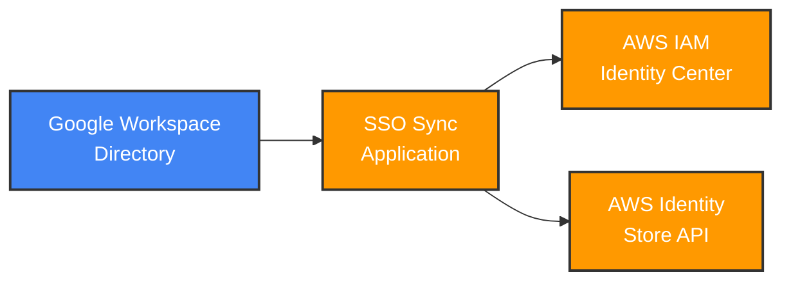
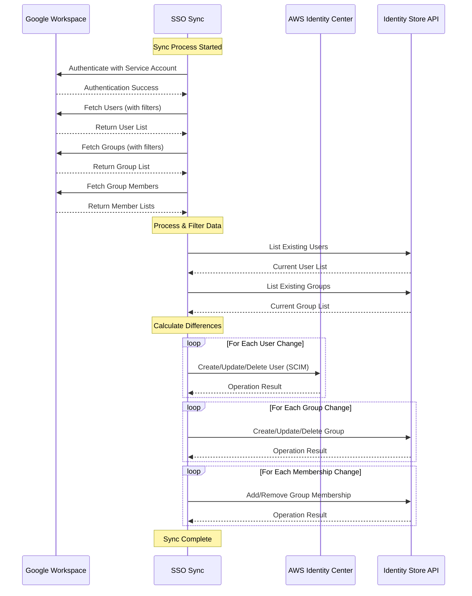

# SSO Sync

[](https://github.com/awslabs/ssosync/actions)
[](https://goreportcard.com/report/github.com/awslabs/ssosync)
[](https://www.apache.org/licenses/LICENSE-2.0)
[](https://golang.org/dl/)
[](https://aws.amazon.com/lambda/)

**Synchronize Google Workspace users and groups to AWS IAM Identity Center (formerly AWS SSO)**

SSO Sync is a powerful CLI tool and AWS Lambda function that automatically synchronizes your Google Workspace directory with AWS IAM Identity Center, eliminating manual user management and ensuring your AWS access stays in sync with your organization's identity provider.

## 📑 Table of Contents

- [🚀 Quick Start](#-quick-start)
- [✨ Features](#-features)
- [🎯 Why SSO Sync?](#-why-sso-sync)
- [📋 Prerequisites](#-prerequisites)
- [🏗️ Architecture](#️-architecture)
- [📦 Installation & Deployment](#-installation--deployment)
- [⚙️ Configuration](#️-configuration)
- [🚀 Usage](#-usage)
- [⚠️ Important Notes](#️-important-notes)
- [🔧 Troubleshooting](#-troubleshooting)
- [📊 Monitoring & Metrics](#-monitoring--metrics)
- [🤝 Contributing](#-contributing)
- [📚 Additional Resources](#-additional-resources)
- [📄 License](#-license)

## 🚀 Quick Start

### Option 1: AWS Serverless Application Repository (Recommended)
Deploy directly from the [AWS Serverless Application Repository](https://console.aws.amazon.com/lambda/home#/create/app?applicationId=arn:aws:serverlessrepo:us-east-2:004480582608:applications/SSOSync) - the fastest way to get started.

### Option 2: Guided Workshop
Follow this comprehensive [lab](https://catalog.workshops.aws/control-tower/en-US/authentication-authorization/google-workspace) in the AWS Control Tower Workshop for step-by-step setup instructions.

### Option 3: Local Development
```bash
# Clone and build
git clone https://github.com/awslabs/ssosync.git
cd ssosync
make setup    # Install all dependencies
make build    # Build the application
```

## ✨ Features

- **🔄 Bidirectional Sync**: Automatically sync users and groups from Google Workspace to AWS IAM Identity Center
- **🚀 Multiple Deployment Options**: CLI tool, AWS Lambda, or Serverless Application Repository
- **⚡ High Performance**: Optimized with caching and efficient API usage for large directories
- **🎯 Flexible Filtering**: Advanced user/group matching patterns and ignore lists
- **🔧 Two Sync Methods**:
  - `groups` (default): Sync based on Google groups and their members
  - `users_groups`: Sync users first, then groups and memberships
- **🛡️ Production Ready**: Includes retry logic, error handling, and comprehensive logging
- **📊 Monitoring**: Built-in metrics and health checks

> [!CAUTION]
> When using ssosync with an instance of IAM Identity Center integrated with AWS Control Tower. AWS Control Tower creates a number of groups and users (directly via the Identity Store API), when an external identity provider is configured these users and groups are can not be used to log in. However it is important to remember that because ssosync implemements a uni-directional sync it will make the IAM Identity Store match the subset of your Google Workspaces directory you specify, including removing these groups and users created by AWS Control Tower. There is a PFR [#179 Configurable handling of 'manually created' Users/Groups in IAM Identity Center](https://github.com/awslabs/ssosync/issues/179) to implement an option to ignore these users and groups, hopefully this will be implemented in version 3.x. However, this has a dependancy on PFR [#166 Ensure all groups/user creates in IAM Identity Store are via SCIM api and populate externalId field](https://github.com/awslabs/ssosync/issues/166), to be able to reliably and consistently disinguish between **SCIM Provisioned** users from **Manually Created** users

> [!WARNING]
> There are breaking changes for versions `>= 0.02`

> [!WARNING]
> `>= 1.0.0-rc.5` groups to do not get deleted in AWS SSO when deleted in the Google Directory, and groups are synced by their email address

> [!WARNING]
> `>= 2.0.0` this makes use of the **Identity Store API** which means:
> * if deploying the lambda from the [AWS Serverless Application Repository](https://console.aws.amazon.com/lambda/home#/create/app?applicationId=arn:aws:serverlessrepo:us-east-2:004480582608:applications/SSOSync) then it needs to be deployed into the [IAM Identity Center delegated administration](https://docs.aws.amazon.com/singlesignon/latest/userguide/delegated-admin.html) account. Technically you could deploy in the management account but we would recommend against this.
> * if you are running the project as a cli tool, then the environment will need to be using credentials of a user in the [IAM Identity Center delegated administration](https://docs.aws.amazon.com/singlesignon/latest/userguide/delegated-admin.html) account, with appropriate permissions.

> [!WARNING]
> `>= 2.1.0` make use of named IAM resources, so if deploying via CICD or IaC template will require **CAPABILITY_NAMED_IAM** to be specified.

> [!IMPORTANT]
> `>= 2.1.0 < 2.3.0` switched to using `provided.al2` powered by ARM64 instances.

> [!IMPORTANT]
> As of `v2.2.0` multiple query patterns are supported for both Group and User matching, simply separate each query with a `,`. For full sync of groups and/or users specify '*' in the relevant match field. 
> User match and group match can now be used in combination with the sync method of groups.
> Nested groups will now be flattened into the top level groups.
> External users are ignored.
> Group owners are treated as regular group members.
> User details are now cached to reduce the number of api calls and improve execution times on large directories.

> [!IMPORTANT]
> `>= 2.3.0` switched to using `provided.al2023` powered by ARM64 instances with golang 1.24 binaries.

## 🎯 Why SSO Sync?

AWS IAM Identity Center (formerly AWS SSO) is a powerful service for managing access to multiple AWS accounts and applications. However, it has limited built-in support for identity providers beyond Azure AD.

**The Challenge:**
- Manual user management in AWS IAM Identity Center is time-consuming and error-prone
- AWS SSO only has native support for Azure AD automatic provisioning
- Google Workspace users need to be manually created and maintained

**The Solution:**
SSO Sync bridges this gap by providing automated synchronization between Google Workspace and AWS IAM Identity Center using the SCIM protocol and AWS Identity Store API.

### Key Benefits

- **🕒 Save Time**: Eliminate manual user provisioning and deprovisioning
- **🔒 Improve Security**: Ensure users are removed from AWS when they leave your organization
- **📈 Scale Easily**: Handle hundreds or thousands of users automatically
- **🎯 Stay Synchronized**: Keep AWS access in sync with your Google Workspace directory
- **⚙️ Flexible Configuration**: Fine-tune sync behavior with filters and patterns

## 📋 Prerequisites

Before you begin, ensure you have:

### Google Workspace Requirements
- Google Workspace admin access
- Ability to create service accounts in Google Cloud Console
- Domain admin privileges for directory access

### AWS Requirements
- AWS account with IAM Identity Center enabled
- Appropriate permissions to create Lambda functions (if using Lambda deployment)
- Access to the IAM Identity Center delegated administration account

### Development Requirements (for local development)
- Go 1.24 or later
- Make (for build automation)
- Git

## 🏗️ Architecture

### High-Level Data Flow



### Sync Process Flow



### How SSO Sync Works

1. **🔐 Authentication**: Connects to Google Workspace using service account credentials
2. **📥 Data Retrieval**: Fetches users, groups, and memberships from Google Directory API
3. **🔍 Filtering**: Applies user-defined filters and ignore patterns
4. **📊 Comparison**: Compares Google data with current AWS IAM Identity Center state
5. **🔄 Synchronization**: Creates, updates, or deletes users and groups via SCIM and Identity Store APIs
6. **✅ Validation**: Ensures data consistency between both systems

> AWS Single Sign-On (SSO) makes it easy to centrally manage access
> to multiple AWS accounts and business applications and provide users
> with single sign-on access to all their assigned accounts and applications
> from one place.

Key part further down:

> With AWS SSO, you can create and manage user identities in AWS SSO’s
>identity store, or easily connect to your existing identity source including
> Microsoft Active Directory and **Azure Active Directory (Azure AD)**.

AWS SSO can use other Identity Providers as well... such as Google Apps for Domains. Although AWS SSO
supports a subset of the SCIM protocol for populating users, it currently only has support for Azure AD.

This project provides a CLI tool to pull users and groups from Google and push them into AWS SSO.
`ssosync` deals with removing users as well. The heavily commented code provides you with the detail of
what it is going to do.

### References

 * [SCIM Protocol RFC](https://tools.ietf.org/html/rfc7644)
 * [AWS SSO - Connect to Your External Identity Provider](https://docs.aws.amazon.com/singlesignon/latest/userguide/manage-your-identity-source-idp.html)
 * [AWS SSO - Automatic Provisioning](https://docs.aws.amazon.com/singlesignon/latest/userguide/provision-automatically.html)
 * [AWS IAM Identity Center - Identity Store API](https://docs.aws.amazon.com/singlesignon/latest/IdentityStoreAPIReference/welcome.html)

## 📦 Installation & Deployment

### Recommended Deployment (AWS Lambda)

1. **Setup AWS IAM Identity Center**
   - [Enable IAM Identity Center](https://docs.aws.amazon.com/singlesignon/latest/userguide/get-started-enable-identity-center.html) in your AWS organization's management account
   - Create a dedicated `Identity` account for managing IAM Identity Center
   - [Delegate administration](https://docs.aws.amazon.com/singlesignon/latest/userguide/delegated-admin.html) to the `Identity` account

2. **Deploy from AWS Serverless Application Repository**
   - Navigate to the [SSOSync app](https://console.aws.amazon.com/lambda/home#/create/app?applicationId=arn:aws:serverlessrepo:us-east-2:004480582608:applications/SSOSync)
   - Configure the required parameters
   - Deploy the application

### Alternative Deployment Options

#### Option 1: Pre-built Binaries
Download the latest release from the [GitHub releases page](https://github.com/awslabs/ssosync/releases):

```bash
# Download for your platform
curl -L -o ssosync https://github.com/awslabs/ssosync/releases/latest/download/ssosync_linux_amd64
chmod +x ssosync
```

#### Option 2: Build from Source
```bash
# Clone the repository
git clone https://github.com/awslabs/ssosync.git
cd ssosync

# Setup development environment (installs all tools)
make setup

# Build the application
make build

# Run tests
make test

# Generate coverage report
make test-coverage
```

#### Option 3: Go Install
```bash
go install github.com/awslabs/ssosync@latest
```

### Development Tools

The project includes automated tool management:

```bash
# Install all development dependencies
make install-deps

# Check tool versions
make check-tools

# Run CI pipeline locally
make ci

# Clean everything
make clean-all
```

**Included Tools:**
- **mockery v3.5.2**: Mock generation for testing
- **golangci-lint v2.3.1**: Comprehensive linting
- **goreleaser v2.11.2**: Release automation
- **upx v4.2.4**: Executable compression

## ⚠️ Important Notes

### 🚨 Critical Considerations

#### AWS Control Tower Integration
> **⚠️ CAUTION**: When using SSO Sync with AWS Control Tower's IAM Identity Center integration, be aware that:
> - AWS Control Tower creates default users and groups via the Identity Store API
> - SSO Sync implements **uni-directional sync** and will make IAM Identity Store match your Google Workspace directory
> - This may remove AWS Control Tower-created users and groups
> - Future versions will include options to ignore manually created users/groups ([Issue #179](https://github.com/awslabs/ssosync/issues/179))

#### Deployment Requirements
> **📍 IMPORTANT**: For versions `>= 2.0.0`:
> - Lambda deployments must be in the [IAM Identity Center delegated administration account](https://docs.aws.amazon.com/singlesignon/latest/userguide/delegated-admin.html)
> - CLI usage requires credentials from the delegated administration account
> - CloudFormation deployments require `CAPABILITY_NAMED_IAM` capability

### 🔄 Version History & Breaking Changes

| Version | Key Changes |
|---------|-------------|
| `>= 2.3.0` | ARM64 instances with Go 1.24, `provided.al2023` runtime |
| `>= 2.2.0` | Multiple query patterns, nested group flattening, improved caching |
| `>= 2.1.0` | Named IAM resources, ARM64 support |
| `>= 2.0.0` | Identity Store API integration, delegated admin requirement |
| `>= 1.0.0-rc.5` | Groups synced by email address, deletion behavior changes |
| `>= 0.02` | Breaking changes introduced |

### 🎯 Current Version Features

**Enhanced Performance & Functionality:**
- ✅ Multiple query patterns support (comma-separated)
- ✅ Nested groups flattened to top-level groups  
- ✅ External users automatically ignored
- ✅ Group owners treated as regular members
- ✅ User details caching for improved performance
- ✅ ARM64 architecture support
- ✅ Go 1.24 runtime

## ⚙️ Configuration

SSO Sync requires configuration from both Google Workspace and AWS. Follow these steps to set up the necessary credentials and permissions.

### 🔧 Quick Configuration Checklist

- [ ] Google Workspace service account created
- [ ] Google Admin SDK API enabled
- [ ] AWS IAM Identity Center automatic provisioning enabled
- [ ] SCIM endpoint and access token obtained
- [ ] Identity Store ID retrieved
- [ ] Configuration validated

### 📋 Detailed Configuration Steps

### Google

First, you have to setup your API. In the project you want to use go to the [Console](https://console.developers.google.com/apis) and select *API & Services* > *Enable APIs and Services*. Search for *Admin SDK* and *Enable* the API.

You have to perform this [tutorial](https://developers.google.com/admin-sdk/directory/v1/guides/delegation) to create a service account that you use to sync your users. Save the `JSON file` you create during the process and rename it to `credentials.json`.

> you can also use the `--google-credentials` parameter to explicitly specify the file with the service credentials. Please, keep this file safe, or store it in the AWS Secrets Manager

In the domain-wide delegation for the Admin API, you have to specify the following scopes for the user.

* https://www.googleapis.com/auth/admin.directory.group.readonly
* https://www.googleapis.com/auth/admin.directory.group.member.readonly
* https://www.googleapis.com/auth/admin.directory.user.readonly

Back in the Console go to the Dashboard for the API & Services and select "Enable API and Services".
In the Search box type `Admin` and select the `Admin SDK` option. Click the `Enable` button.

You will have to specify the email address of an admin via `--google-admin` to assume this users role in the Directory.

### AWS

Go to the AWS Single Sign-On console in the region you have set up AWS SSO and select
Settings. Click `Enable automatic provisioning`.

A pop up will appear with URL and the Access Token. The Access Token will only appear
at this stage. You want to copy both of these as a parameter to the `ssosync` command.

Or you specific these as environment variables.

```bash
SSOSYNC_SCIM_ACCESS_TOKEN=<YOUR_TOKEN>
SSOSYNC_SCIM_ENDPOINT=<YOUR_ENDPOINT>
```

Additionally, authenticate your AWS credentials. Follow this  [section](https://docs.aws.amazon.com/sdk-for-go/v1/developer-guide/configuring-sdk.html#:~:text=Creating%20the%20Credentials%20File) to create a Shared Credentials File in the home directory or export your Credentials with Environment Variables. Ensure that the default credentials are for the AWS account you intended to be synced.

To obtain your `Identity store ID`, go to the AWS Identity Center console and select settings. Under the `Identity Source` section, copy the `Identity store ID`.

## 🚀 Usage

### Command Line Interface

After installation, you can use SSO Sync from the command line:

```bash
# Display help and all available options
ssosync --help

# Basic sync with minimal configuration
ssosync \
  --google-admin admin@yourcompany.com \
  --google-credentials ./credentials.json \
  --scim-endpoint https://scim.amazonaws.com/12345678-1234-1234-1234-123456789012/scim/v2/ \
  --scim-access-token AQoDYXdzEJr... \
  --region us-east-1 \
  --identity-store-id d-1234567890

# Sync specific groups only
ssosync \
  --google-admin admin@yourcompany.com \
  --google-credentials ./credentials.json \
  --scim-endpoint https://scim.amazonaws.com/12345678-1234-1234-1234-123456789012/scim/v2/ \
  --scim-access-token AQoDYXdzEJr... \
  --region us-east-1 \
  --identity-store-id d-1234567890 \
  --group-match "name:AWS*,email:aws-*" \
  --sync-method groups

# Sync with user filtering and ignore lists
ssosync \
  --google-admin admin@yourcompany.com \
  --google-credentials ./credentials.json \
  --scim-endpoint https://scim.amazonaws.com/12345678-1234-1234-1234-123456789012/scim/v2/ \
  --scim-access-token AQoDYXdzEJr... \
  --region us-east-1 \
  --identity-store-id d-1234567890 \
  --user-match "name:John*,email:admin*" \
  --ignore-users "service@yourcompany.com,bot@yourcompany.com" \
  --ignore-groups "temp-group@yourcompany.com" \
  --log-level debug
```

### Environment Variables

You can also configure SSO Sync using environment variables:

```bash
export SSOSYNC_GOOGLE_ADMIN="admin@yourcompany.com"
export SSOSYNC_GOOGLE_CREDENTIALS="./credentials.json"
export SSOSYNC_SCIM_ENDPOINT="https://scim.amazonaws.com/12345678-1234-1234-1234-123456789012/scim/v2/"
export SSOSYNC_SCIM_ACCESS_TOKEN="AQoDYXdzEJr..."
export SSOSYNC_REGION="us-east-1"
export SSOSYNC_IDENTITY_STORE_ID="d-1234567890"
export SSOSYNC_LOG_LEVEL="info"
export SSOSYNC_SYNC_METHOD="groups"

# Run with environment variables
ssosync
```

### Configuration Examples

#### Example 1: Sync All AWS-Related Groups
```bash
ssosync \
  --group-match "name:AWS*,email:aws-*" \
  --sync-method groups \
  --log-level info
```

#### Example 2: Sync Specific Users and Their Groups
```bash
ssosync \
  --user-match "name:John*,email:admin*" \
  --sync-method users_groups \
  --log-level debug
```

#### Example 3: Full Directory Sync with Exclusions
```bash
ssosync \
  --user-match "*" \
  --group-match "*" \
  --ignore-users "service@company.com,bot@company.com" \
  --ignore-groups "temp@company.com,test@company.com" \
  --sync-method groups
```

```bash
A command line tool to enable you to synchronise your Google
Apps (Google Workspace) users to AWS Single Sign-on (AWS SSO)
Complete documentation is available at https://github.com/awslabs/ssosync

Usage:
  ssosync [flags]

Flags:
  -t, --access-token string         AWS SSO SCIM API Access Token
  -d, --debug                       enable verbose / debug logging
  -e, --endpoint string             AWS SSO SCIM API Endpoint
  -u, --google-admin string         Google Workspace admin user email
  -c, --google-credentials string   path to Google Workspace credentials file (default "credentials.json")
  -g, --group-match string          Google Workspace Groups filter query parameter, a simple '*' denotes sync all groups (and any users that are members of those groups). example: 'name:Admin*,email:aws-*', 'name=Admins' or '*' see: https://developers.google.com/admin-sdk/directory/v1/guides/search-groups, if left empty no groups will be selected.
  -h, --help                        help for ssosync
      --ignore-groups strings       ignores these Google Workspace groups
      --ignore-users strings        ignores these Google Workspace users
      --include-groups strings      include only these Google Workspace groups, NOTE: only works when --sync-method 'users_groups'
      --log-format string           log format (default "text")
      --log-level string            log level (default "info")
  -s, --sync-method string          Sync method to use (users_groups|groups) (default "groups")
  -m, --user-match string           Google Workspace Users filter query parameter, a simple '*' denotes sync all users in the directory. example: 'name:John*,email:admin*', '*' or name=John Doe,email:admin*' see: https://developers.google.com/admin-sdk/directory/v1/guides/search-users, if left empty no users will be selected but if a pattern has been set for GroupMatch users that are members of the groups it matches will still be selected
  -v, --version                     version for ssosync
  -r, --region                      AWS region where identity store exists
  -i, --identity-store-id           AWS Identity Store ID
```

The function has `two behaviour` and these are controlled by the `--sync-method` flag, this behavior could be

1. `groups`: __(default)__ The sync procedure work base on Groups, gets the Google Workspace groups and their members, then creates in AWS SSO the users (members of the Google Workspace groups), then the groups and at the end assign the users to their respective groups.
2. `users_groups`: __(original behavior, previous versions)__ The sync procedure is simple, gets the Google Workspace users and creates these in AWS SSO Users; then gets Google Workspace groups and creates these in AWS SSO Groups and assigns users to belong to the AWS SSO Groups.

Flags Notes:

* `--include-groups` only works when `--sync-method` is `users_groups`
* `--ignore-users` works for both `--sync-method` values.  Example: `--ignore-users user1@example.com,user2@example.com` or `SSOSYNC_IGNORE_USERS=user1@example.com,user2@example.com`
* `--ignore-groups` works for both `--sync-method` values. Example: --ignore-groups group1@example.com,group1@example.com` or `SSOSYNC_IGNORE_GROUPS=group1@example.com,group1@example.com`
* `--group-match` works for both `--sync-method` values and also in combination with `--ignore-groups` and `--ignore-users`.  This is the filter query passed to the [Google Workspace Directory API when search Groups](https://developers.google.com/admin-sdk/directory/v1/guides/search-groups), if the flag is not used, groups are not filtered.
* `--user-match` works for both `--sync-method` values and also in combination with `--ignore-groups` and `--ignore-users`.  This is the filter query passed to the [Google Workspace Directory API when search Users](https://developers.google.com/admin-sdk/directory/v1/guides/search-users), if the flag is not used, users are not filtered.

> [!NOTE]
> 1. Depending on the number of users and groups you have, maybe you can get `AWS SSO SCIM API rate limits errors`, and more frequently happens if you execute the sync many times in a short time.
> 2. Depending on the number of users and groups you have, `--debug` flag generate too much logs lines in your AWS Lambda function.  So test it in locally with the `--debug` flag enabled and disable it when you use a AWS Lambda function.

## AWS Lambda Usage

> [!TIP]
> Using Lambda may incur costs in your AWS account. Please make sure you have checked
the pricing for AWS Lambda and CloudWatch before continuing.

Additionally, before choosing to deploy with Lambda, please ensure that the [AWS Lambda SLAs](https://aws.amazon.com/lambda/sla/) are sufficient for your use cases.

Running ssosync once means that any changes to your Google directory will not appear in
AWS SSO. To sync regularly, you can run ssosync via AWS Lambda.

> [!WARNING]
> You find it in the [AWS Serverless Application Repository](https://eu-west-1.console.aws.amazon.com/lambda/home#/create/app?applicationId=arn:aws:serverlessrepo:us-east-2:004480582608:applications/SSOSync).

> [!TIP]
> ### v2.1 Changes
> * user and group selection fields in the Cloudformation template can now be left empty where not required and will not be added as environment variables to the Lambda function, this provides consistency with CLI use of ssosync.
> * Stronger validation of parameters in the Cloudformation template, to improve likelhood of success for new users.
> * Now supports multiple deployment patterns, defaults are consistent with previous versions.

**App + secrets** This is the default mode and fully backwards compatible with previous versions

**App only** This mode does not create the secrets but expects you to deployed a separate stack using the **Secrets only** mode within the same account
> [!CAUTION]
> If you want to use your own existing secrets then provide them as a comma separated list in the ##CrossStackConfigI## field in the following order:
> __GoogleCredentials ARN__,__GoogleAdminEmail ARN__,__SCIMEndpoint ARN__,__SCIMAccessToken ARN__,__Region ARN__,__IdentityStoreID ARN__
> 
**App for cross-account** This mode is used where you have deployed the secrets in a separate account, the arns of the KMS key and secrets need to be passed into the __CrossStackConfig__ field, It is easiest to have created the secrets in the other account using the ** Secrest for cross-account** mode, as the output can simply copied and pasted into the above field.

> [!CAUTION]
> If you want to use your own existing secrets then provide them as a comma separated list in the __CrossStackConfig__ field in the following order:
> __GoogleCredentials ARN__,__GoogleAdminEmail ARN__,__SCIMEndpoint ARN__,__SCIMAccessToken ARN__,__Region ARN__,__IdentityStoreID ARN__,__KMS Key ARN__

> [!IMPORTANT]
> Be sure to allow access to the key and secrets in their respective policies to the role __SSOSyncAppRole__ in the app account.

**Secrets only** This mode creates a set of secrets but does not deploy the app itself, it requires the app is deployed in that same account using the **App only** mode. This allows for decoupling of the secrets and the app.

**Secrets for cross-account** This mode creates a set of secrets and KMS key but does not deploy the app itself, this is for use with an app stack, deployed using the **App for cross-account** mode. This allows for a single set of secrets to be shared with multipl app instance for testing, and improve secrets security.

## SAM

You can use the AWS Serverless Application Model (SAM) to deploy this to your account.

> Please, install the [AWS SAM CLI](https://docs.aws.amazon.com/serverless-application-model/latest/developerguide/serverless-sam-cli-install.html) and [GoReleaser](https://goreleaser.com/install/).

Specify an Amazon S3 Bucket for the upload with `export S3_BUCKET=<YOUR_BUCKET>` and an S3 prefix with `export S3_PREFIX=<YOUR_PREFIX>`.

Execute `make package` in the console. Which will package and upload the function to the bucket. You can then use the `packaged.yaml` to configure and deploy the stack in [AWS CloudFormation Console](https://console.aws.amazon.com/cloudformation).

### Example

Build

```bash
aws cloudformation validate-template --template-body  file://sar-template.json 1>/dev/null &&
sam validate &&
sam build
```

Deploy

```bash
sam deploy --guided
```

## 🔧 Troubleshooting

### Common Issues

#### Issue: "Error getting active status for user"
**Solution**: Ensure your AWS credentials have the necessary permissions for the Identity Store API.

#### Issue: "Problem establishing a connection to Google directory"
**Solution**: 
- Verify your service account credentials are correct
- Ensure the Admin SDK API is enabled
- Check that domain-wide delegation is properly configured

#### Issue: "SCIM API rate limits errors"
**Solution**: 
- Reduce the frequency of sync operations
- Use more specific filters to reduce the number of operations
- Consider using the `--log-level debug` flag to identify bottlenecks

#### Issue: "Groups not syncing"
**Solution**:
- Verify your `--group-match` parameter is correct
- Check that groups exist in Google Workspace
- Ensure groups are not in the ignore list

### Performance Optimization

For large directories (1000+ users/groups):

1. **Use Specific Filters**: Instead of syncing everything, use targeted filters
2. **Enable Caching**: The application automatically caches user details
3. **Monitor Logs**: Use `--log-level info` to monitor performance
4. **Schedule Appropriately**: Don't run sync too frequently

### Debug Mode

Enable debug logging for detailed troubleshooting:

```bash
ssosync --log-level debug --log-format json
```

## 📊 Monitoring & Metrics

### Lambda Monitoring

When deployed as a Lambda function, monitor:
- **Execution Duration**: Should complete within timeout limits
- **Memory Usage**: Monitor for memory spikes with large directories
- **Error Rate**: Track failed executions
- **CloudWatch Logs**: Review logs for sync details

### Key Metrics to Track

- Number of users synchronized
- Number of groups synchronized
- Sync execution time
- API call rates and limits
- Error rates and types

## 🤝 Contributing

We welcome contributions! Please see our [Contributing Guide](CONTRIBUTING.md) for details.

### Development Setup

```bash
# Clone and setup
git clone https://github.com/awslabs/ssosync.git
cd ssosync
make setup

# Run tests
make test

# Run linting
make lint

# Run full CI pipeline
make ci
```

### Running Tests

```bash
# Run all tests
make test

# Run tests with coverage
make test-coverage

# Run benchmarks
go test -bench=. ./internal/ -benchmem

# Run integration tests (requires credentials)
go test -tags=integration ./...
```

## 📚 Additional Resources

### Documentation
- [AWS IAM Identity Center User Guide](https://docs.aws.amazon.com/singlesignon/latest/userguide/)
- [Google Workspace Admin SDK](https://developers.google.com/admin-sdk)
- [SCIM Protocol RFC](https://tools.ietf.org/html/rfc7644)

### Related AWS Services
- [AWS IAM Identity Center](https://aws.amazon.com/single-sign-on/)
- [AWS Identity Store API](https://docs.aws.amazon.com/singlesignon/latest/IdentityStoreAPIReference/welcome.html)
- [AWS Lambda](https://aws.amazon.com/lambda/)

### Community
- [GitHub Issues](https://github.com/awslabs/ssosync/issues)
- [GitHub Discussions](https://github.com/awslabs/ssosync/discussions)

## 📄 License

This project is licensed under the Apache License 2.0 - see the [LICENSE](LICENSE) file for details.

## 🙏 Acknowledgments

- AWS Labs team for the original implementation
- Contributors who have helped improve the project
- The Go community for excellent tooling and libraries

---

**Made with ❤️ by the AWS Labs team**
